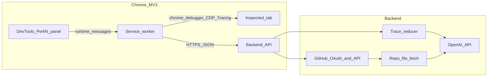

# Architecture — Perf Trace Analyzer

## Context diagram

## Components

### Extension (`extension/`)

- **Manifest V3** with `devtools_page`, `background` service worker, `storage`, and `debugger`.
- **DevTools page** (`devtools.html` + `devtools.js`) registers the **Perf AI** panel.
- **Panel** (`panel.html` + `panel.js`) — configure API base URL, import trace JSON, start/stop CDP recording via messages to the service worker.
- **Service worker** (`background.js`) — attaches `chrome.debugger` to the inspected tab, sends `Tracing.start` / `Tracing.end`, listens for `Tracing.dataCollected` and `Tracing.tracingComplete`, assembles trace JSON, posts to backend.

**Important:** Chrome does not expose the built-in Performance panel's in-memory trace to extensions. CDP `Tracing` produces the same class of trace data as an exported Performance recording.

### Backend (`backend/`)

- **HTTP API** (Fastify) — CORS enabled for `chrome-extension://` origins in development.
- **Ingest** — `POST /traces` accepts JSON trace (`traceEvents` array or Chrome array form). Size cap enforced.
- **Reducer** — deterministic extraction of top long tasks, high-duration events, and URL/script hints into `compactSummary` (bounded size).
- **Analyze** — `POST /traces/:id/analyze` calls OpenAI with structured JSON output schema; optional second stage when GitHub token + repo are configured (placeholder routes return structured stubs until wired).

### Secrets and trust boundaries

| Asset | Location | Crosses wire |
|-------|----------|----------------|
| OpenAI API key | Server env only | Server -> OpenAI |
| GitHub OAuth client secret | Server env only | Server -> GitHub |
| User GitHub access token | Server DB or memory stub | Server -> GitHub API |
| Raw trace | Browser -> Server (HTTPS) | User content; treat as sensitive |
| Reduced summary + LLM | Server -> OpenAI | Minimize PII; configurable retention |

Default retention: traces stored in memory with TTL (see `backend/src/store.js`); production should use object storage + shorter TTL.

## Trace pipeline

1. **Capture or import** — CDP trace or file -> `traceEvents[]` (or equivalent).
2. **Upload** — `POST /traces` -> validate size -> parse -> reduce.
3. **Analyze** — `POST /traces/:id/analyze` -> OpenAI(messages) with compact input + optional code snippets from GitHub.

## Git correlation (v1 direction)

1. Reducer emits `candidates.urls` and stack-like strings.
2. Backend resolves GitHub tree for `owner/repo@ref` (future: full OAuth + Contents API).
3. LLM receives only **fetched snippets** with line numbers; output must cite `path:line` from provided text only.

## Extension permissions

| Permission | Why |
|------------|-----|
| `debugger` | CDP `Tracing` attach to inspected tab |
| `storage` | Persist API base URL |
| `devtools_page` | Register DevTools panel |

While attached, Chrome shows **"Chrome is being controlled by automated test software"** (debugger banner). Document in UI.

## Threat model (short)

- **Trace leakage** — traces may contain URLs, headers, or script content. Use HTTPS, cap size, delete after TTL, avoid logging bodies.
- **Token theft** — encrypt GitHub tokens at rest in production; never return them to the extension.
- **Over-broad tracing** — offer "safe" vs "deep" presets; deep may include more PII-risk categories.
