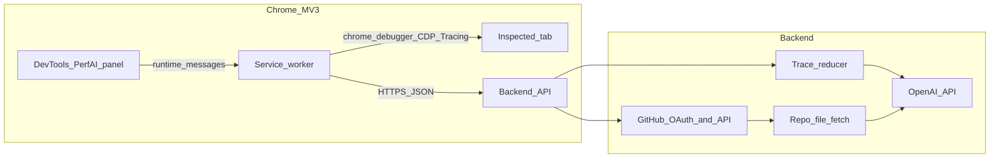

# Architecture — Perf Trace Analyzer

## Context diagram



## Components

### Extension (`extension/`)

- **Manifest V3** with `devtools_page`, `background` service worker, `storage`, and `debugger`.
- **DevTools page** (`devtools.html` + `devtools.js`) registers the **Perf AI** panel.
- **Panel** (`panel.html` + `panel.js`) — configure API base URL, import trace JSON, start/stop CDP recording via messages to the service worker.
- **Service worker** (`background.js`) — attaches `chrome.debugger` to the inspected tab, sends `Tracing.start` / `Tracing.end`, listens for `Tracing.dataCollected` and `Tracing.tracingComplete`, assembles trace JSON, posts to backend.

**Important:** Chrome does not expose the built-in Performance panel's in-memory trace to extensions. CDP `Tracing` produces the same class of trace data as an exported Performance recording.

### Backend (`backend/`)

- **HTTP API** (Fastify) — CORS enabled for `chrome-extension://` origins in development.
- **Ingest** — `POST /traces` accepts JSON trace (`traceEvents` array or Chrome array form). Size cap enforced.
- **Reducer** — deterministic extraction of top long tasks, high-duration events, and URL/script hints into `compactSummary` (bounded size).
- **Analyze** — `POST /traces/:id/analyze` calls OpenAI with structured JSON output schema; with a linked GitHub repo, the server fetches a **bounded** set of files—either **auto** (skeleton + trace-correlated paths) or **components** mode when `githubComponentsPath` is set: recursive listing under that repo-relative folder, **at most 6** matching source files or **`400`**, full file bodies with **line numbers** in excerpts. Recommendations may include **`codeSuggestion`** and **`path:line`** `codePointer` grounded in excerpts.

### Secrets and trust boundaries

| Asset | Location | Crosses wire |
|-------|----------|----------------|
| OpenAI API key | Server env only | Server -> OpenAI |
| GitHub OAuth client secret | Server env only | Server -> GitHub |
| User GitHub access token | Server DB or memory stub | Server -> GitHub API |
| Raw trace | Browser -> Server (HTTPS) | User content; treat as sensitive |
| Reduced summary + LLM | Server -> OpenAI | Minimize PII; configurable retention |

Default retention: traces stored in memory with TTL (see `backend/src/store.js`); production should use object storage + shorter TTL.

## Trace pipeline

1. **Capture or import** — CDP trace or file -> `traceEvents[]` (or equivalent).
2. **Upload** — `POST /traces` -> validate size -> parse -> reduce.
3. **Analyze** — `POST /traces/:id/analyze` -> OpenAI(messages) with compact input + optional GitHub excerpts (skeleton + trace-linked files, capped count/size).

## Git correlation (v1 direction)

1. Reducer surfaces URL/script hints in `compactSummary`.
2. Backend calls GitHub Contents API for a **fixed candidate path list** (skeleton files at repo and package roots, then paths derived from trace URLs); optional token for private repos.
3. LLM receives only **fetched snippets**; must not claim full-repo knowledge. Output cites `path:line` when inferable; may include **`codeSuggestion`** for copy-paste fixes when grounded.

## Extension permissions

| Permission | Why |
|------------|-----|
| `debugger` | CDP `Tracing` attach to inspected tab |
| `storage` | Persist API base URL |
| `devtools_page` | Register DevTools panel |

While attached, Chrome shows **"Chrome is being controlled by automated test software"** (debugger banner). Document in UI.

## Threat model (short)

- **Trace leakage** — traces may contain URLs, headers, or script content. Use HTTPS, cap size, delete after TTL, avoid logging bodies.
- **Token theft** — encrypt GitHub tokens at rest in production; never return them to the extension.
- **Over-broad tracing** — offer "safe" vs "deep" presets; deep may include more PII-risk categories.

## Repo layout (current)

```
backend/
  package.json           Fastify + dotenv; npm scripts: dev, start, test
  .env.example           All env vars documented; .env is git-ignored
  src/
    config.js            Typed env loader (port, CORS, OpenAI, caps, GitHub)
    store.js             In-memory trace + analysis store with TTL eviction
    reducer.js           Deterministic trace -> compactSummary
    llm.js               OpenAI JSON-mode call + ANALYSIS_SCHEMA + local stub
    routes.js            POST/GET/DELETE /traces, POST /traces/:id/analyze, /health
    server.js            Fastify bootstrap, CORS allowlist, security headers
  test/
    smoke.test.mjs       Reducer + ingest/analyze flow + bad-input cases
extension/
  manifest.json          MV3, devtools_page, debugger + storage permissions
  devtools.html / .js    Registers the "Perf AI" panel
  panel.html / .css / .js  UI: API URL, presets, capture, import, results
  background.js          Service worker: chrome.debugger lifecycle, CDP Tracing,
                         buffers events, POSTs to backend, runs analyze
```

## Implementation status

| Area | Status | Notes |
|------|--------|-------|
| Extension MV3 manifest | Done | `debugger`, `storage`, `devtools_page`; no host secrets |
| DevTools panel UI | Done | Save API URL, presets, capture, import, results render |
| Service worker capture | Done | `Tracing.start/end`, `dataCollected`, always-detach `finally` |
| Backend ingest + reduce | Done | Body limit, deterministic `compactSummary` |
| Backend analyze (OpenAI) | Done | JSON-mode + `ANALYSIS_SCHEMA`; cached per `traceId` |
| Local analysis stub | Done | Used when `OPENAI_API_KEY` is empty |
| In-memory store + TTL | Done | `TRACE_TTL_MS` configurable |
| CORS allowlist | Done | `ALLOWED_EXTENSION_ORIGINS`, glob `chrome-extension://*` |
| Smoke tests | Done | `npm test` (3 tests) |
| GitHub correlation | Stub only | No OAuth flow yet; reducer emits URL hints already |
| Persistent storage | Pending | In-memory only; production should use object storage |
| Token encryption at rest | Pending | Required before storing real GitHub tokens |
| Streaming / gzip ingest | Pending | Currently buffered JSON within `MAX_TRACE_BYTES` |

## Next steps

1. **Trace ingest hardening**
   - Accept `Content-Encoding: gzip` and stream-parse via a JSON streaming parser to lift the practical size ceiling.
   - Optional `multipart/form-data` upload path for very large `.json` traces.
2. **GitHub correlation (v1)**
   - Add `GET /auth/github/start` / `GET /auth/github/callback` with PKCE; encrypt tokens at rest using a key from `BACKEND_SECRET_KEY` (new env var).
   - `POST /traces/:id/correlate` resolves `candidates.urls` to `owner/repo@ref:path`, fetches snippets via Contents API, then calls the LLM with **only fetched snippets**; output must cite `path:line`.
3. **Persistence**
   - Replace `store.js` Map with pluggable backends: `MemoryStore` (default), `S3Store` (configurable bucket), `RedisStore` (TTL-native).
4. **Reducer improvements**
   - Long-task attribution via `disabled-by-default-devtools.timeline.stack` frames.
   - Resource timing aggregation (request blocked-on, TTFB, transferSize) when `network` events are present.
   - LCP/CLS extraction from `loading` and `blink.user_timing` so the UI can show core web vitals.
5. **Extension UX**
   - Surface the "deep preset = higher PII risk" warning prominently in panel before recording starts.
   - Show a non-blocking banner reminding the user the tab is being controlled by the debugger; auto-detach on panel close.
   - Persist last N analyses keyed by URL for quick comparison.
6. **CI / quality**
   - Add ESLint + Prettier configs (separate for `extension/` and `backend/`).
   - GitHub Actions: install, lint, `npm test` on PR; Bugbot already covered via `.cursor/BUGBOT.md`.
7. **Observability**
   - Structured request logging redacting body content; `/metrics` endpoint with per-route counters.
   - Capture model latency and token counts (without logging prompts) for cost tracking.
8. **Distribution**
   - Add an `icons/` set so the extension can be packaged for Chrome Web Store.
   - Document how to point the panel at a hosted backend (TLS + CORS allowlist for the extension's `chrome-extension://<id>` origin).
